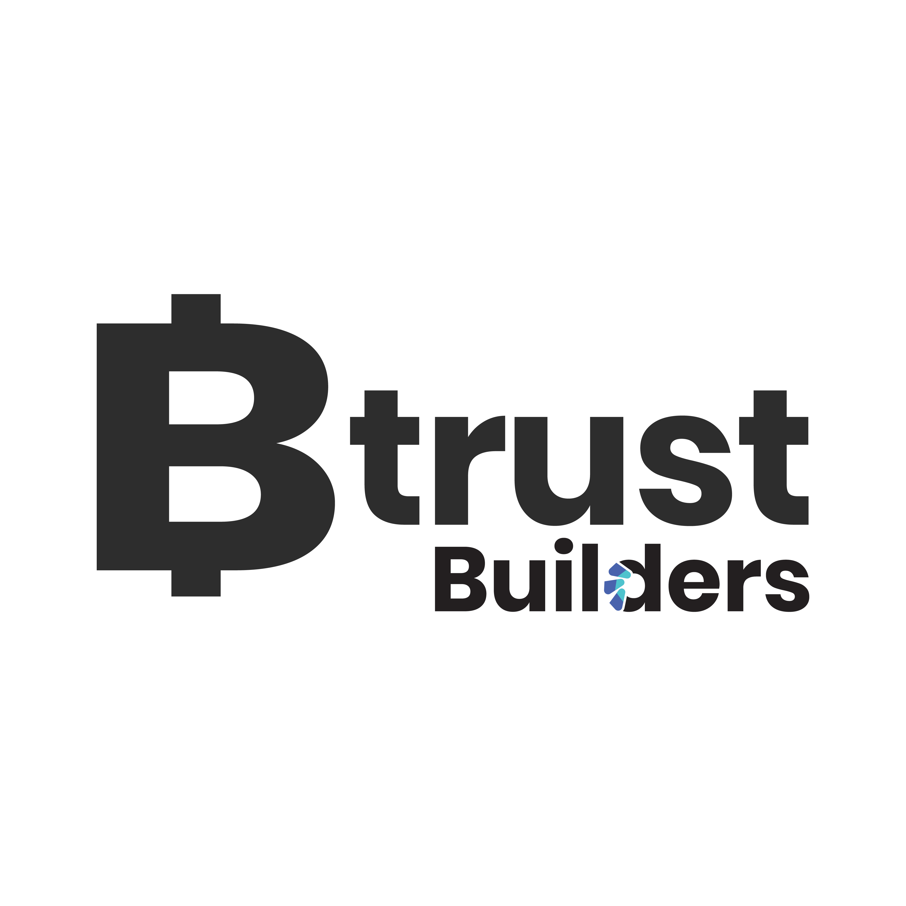

Special thanks to to our sponsors who's donations help pay for venue rental, pizza, drinks, and other meetup expenses.
 
 

- BTrust - [builders.btrust.tech](https://www.btrust.tech/)

Btrust is a non-profit organization with a dedicated mission to decentralize the development of Bitcoin software and focus on fostering developer talent in the global south and supporting the free and open-source Bitcoin ecosystem.
